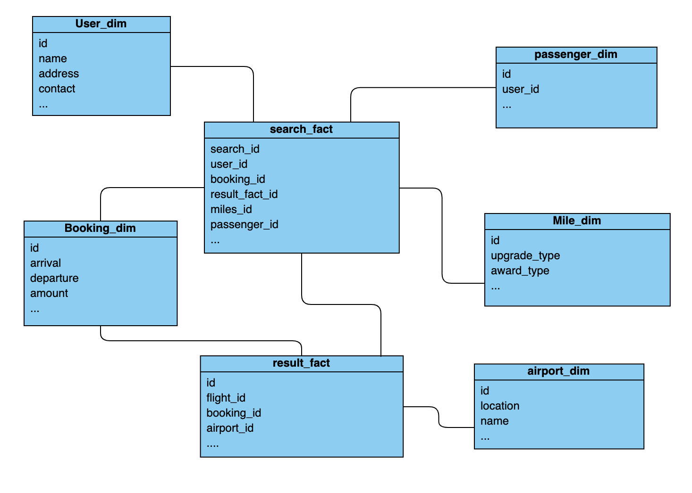
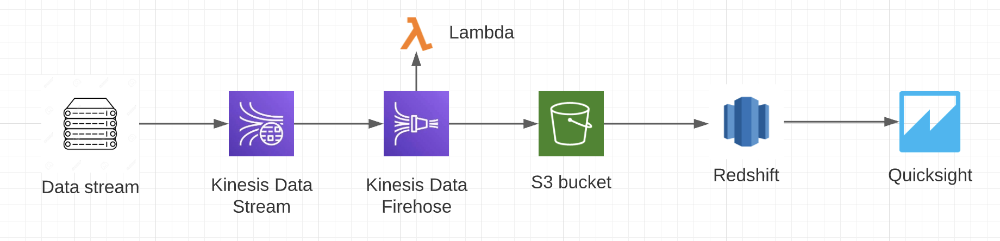

### Problem Statement
Design and build process to consume flight search data within different areas in Alaska air ecosystem to enable efficient analytics, cleaned data sets for data products and improve personalisation experience for the guest.

### Goal 
The goal is to build and design a performance effiective data model to capture and store the data that should be query optimised and enable efficient analytics, also to build a solution to perform real time data capturing and analysis.

### Approach 
Using OLAP data stores would be a great choice for storing the flight search data because use of OLAP data stores allow us to execute complex queries on big data efficiently, it speeds up the analysis and can store big data efficiently. 
To design and build the data model several factors need be looked upon such as:

* what data elements are being used for searching.
* what is the resulting data that we need to store.

#### Search data modeling
After looking on to the flight search requirements and considering several elements that can be utilised through the user interaction for modeling the flight search data, following JSON schema can be defined for it.

``` 
{
    "id":"ahjsadaueysahasajsasafe"
    "flightType" :"1",
    "InfantCount" : 0,
    "IsOneWay" : false,
    "ChildrenCount" : 0,
    "IsRoundTrip" : true,
    "IsMultiCity" : false,
    "AdultCount" : "1 adult",
    "RequiresUmnrService" : "",
    "IsAwardReservation" : false,
    "FareTypeAward" : "NoUpgradePreference",
    "Departure":[
        {"City":"Charlotte, NC (CLT-Douglas Intl.)", "Date" : "5/28/21", "Time" : "Anytime"},
        {"City":"", "Date" : "", "Time" : ""},
        {"City":"", "Date" : "", "Time" : ""},
        {"City":"", "Date" : "", "Time" : ""}
    ],
    "Arrival":[
        {"City":"New York, NY (JFK-Kennedy)", "Date" : "5/28/21", "Time" : "Anytime"},
        {"City":"", "Date" : "", "Time" : ""},
        {"City":"", "Date" : "", "Time" : ""},
        {"City":"", "Date" : "", "Time" : ""}
    ],
    "DiscountCode" : "",
    "ReturnDate" : "5/28/21",
    "ReturnTime" : "Anytime",
    "ContractFareTypeKey" : "",
    "CabinType" : "Main Cabin",
    "AwardOption" : "MilesOnly",
    "ShopAwardCalendar" : false,
    "ShopLowFareCalendar" : false,
    "ShowOnlyContractFares" : false,
    "ShowContractAndAllFares" : false,
    "FareType" : "NoUpgradePreference",
    "IncludeNearbyArrivalAirports" : false,
    "IncludeNearbyDepartureAirports" : false
} 
This data is collected from alaskaair.com for a flight search from Houston, TX to New York, NY.
```  

Above data will be stored as a search request in OLAP data store with the corresponding search result to perform analytics.

#### OLAP data model
Snowflake schema for data modeling could be considered at best for this scenario as it allow us to store data in dimension and fact table which make the data model more scalable as new datasets can easily be added to the model and more performance effective because it minimise the query time.

Assuming that filght details, user details, booking data, etc. is being stored in transactional database for flight recommendation system.

Below is the snowflake data model for flight search analysis.



we have created 2 fact table to which several dimension tables will be linked.
* "Search_fact" : this fact relation will store the search attributes from above Json schema as well as keys for its linked dimension tables
* "Result_fact : this relation will store the the response attributes for the search such as flight details, booking details, passenger detials etc. and it will be linked with several other dimension and fact tables.
* we will be having several dimension tables that will be loaded with transactional database data and will be related with above two fact tables.

#### Process and Tools required
After creating the efficient data model for analysis we need to fill or ingest the data into it. Data ingestion and transformation can be done in following manner:-
* Store the search events and results in any transactional database table or in any datalake file system e.g. S3 buckets with proper event ids.
* For one time historical data dump, we can use DMS to migrate data in bulk or we can use traditional backup and load process.
* After capturing the raw search and result data, we can perform ETL process to transform the data in a way so that it can be stored in OLAP data stores, OLAP data store can be any relational database, data warehouse like AWS Redshift or Datalake like S3.
* ETL operations can be done using several tools such AWS Glue or AWS EMR with the power of Apache Spark.
* After performing the data cleaning and transformation load the data to our OLAP data model and make it available for reporting and analysis.
* To manage the complete workflow we can use AWS Step-Functions or Apache Airflow.


#### Real-Time processing and analysis
To process the data in real-time we can have couple of options as follows:
* Use Apache Spark, Apache Spark support real time data streaming using which we can deliver a streams of data to spark engine in realtime can perform transformations, also Apache spark support real time analytics and report using GraphX, so the real time data stream collected using spark streaming can be further process with GraphX.

* Apache Kafka can be the another real time data processing and analysis option, Kafka has capability to stream real-time data using publish-subscribe model, where producers will generate real-time stream of data that can be consume by kafka consumers across multiple systems. it can store the streams of real-time data in topics. and these topics will be consumed or subscribed by consumers for analytics. In apache kafka infly data transformation is not easy to perform.

* AWS kinesis can be the best approach to deal with the real time data as we can do multiple things with the real-time data stream using AWS kinesis, Kinesis Data Streams can collect real time data streams using kinesis producer library that can be consumed by multiple consumers in real-time, it has very less latency to consume the real time data for analytics and data can be served to mutiple locations simultaneously, also to perform real-time analytics we can use kinesis data anlytics with kinesis data streams and can generate reports and graphs.

#### Pipeline to capture the data and perform analytics.
To process the flight search data in real time we use couple of services and tools like AWS kinesis, redshift, quicksight, etc. that will be performance effective and allow efficient analytics.

Below is the pipeline architectural diagram.


Data streams can be generated from server using kinesis producer library and it will server the real time partitioned data to kinesis data stream, then Kinesis data firehose will act as a consumer and pull the data from kinesis data streams, we have a lambda function running on top of kinesis firehose which will perform serverless in-flight transformation on real-time data stream and after that kinesis firehose will load the data into S3 buckets or we can directly load data to redshift. Redshift is the OLAP data store and to get the data into Redshift we can use scheduled copy commands to pull data from S3 and load the data into Redshift data warehouse cluster, once data is loaded to redshift cluster we can use Quicksight as reporting and analysis tool that will fire query to redshift cluster and generate the output graphs and reports.
Following are the pros and cons for above pipeline
* Pros: It will help to perform real time data analysis on data, it really cost effective as most of the used services are serverless, also the pipeline is easily scalable.
* Cons: Using firehose can have a latency of one mintue as it is near real time service, to keep the data secure during transit we have to use some other service in paraller to it.